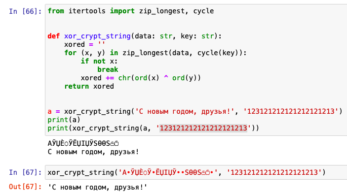

---
## Front matter
lang: ru-RU
title: Отчёт по лабораторной работе 7
author: 'Агеева Анастасия Борисовна'
date: 11 декабря, 2021

## Formatting
toc: false
slide_level: 2
theme: metropolis
mainfont: PT Serif
romanfont: PT Serif
sansfont: PT Sans
monofont: PT Mono
header-includes: 
 - \metroset{progressbar=frametitle,sectionpage=progressbar,numbering=fraction}
 - '\makeatletter'
 - '\beamer@ignorenonframefalse'
 - '\makeatother'
aspectratio: 43
section-titles: true
---

## Цель работы

Приобретение практических навыков установки операционной системы на виртуальную машину, настройки минимально необходимых для дальнейшей работы сервисов.

## Задание

Лабораторная работа подразумевает установку на виртуальную машину VirtualBox (https://www.virtualbox.org/) операционной системы Linux, дистрибутив Centos.

# Выполнение лабораторной работы

1. Разработаем приложение, позволяющее шифровать и
дешифровать данные в режиме однократного гаммирования. (рис.1).

   { #fig:001 width=50% }

---

2. Подоберём ключ, чтобы получить сообщение «С Новым Годом Вас!». После ключа текст становится неизменным. (рис.2).

   { #fig:002 width=50% }

---

3. Контрольные вопросы
1) Поясните смысл однократного гаммирования.
Каждый символ попарно с символом ключа складываются по модулю.
2) Перечислите недостатки однократного гаммирования.
Ключ нельзя переиспользовать. Размер ключа должен быть такой же, как и размер текста.
3) Перечислите преимущества однократного гаммирования.
Основные преимущества однократного гаммирования – это симметричность и криптостойкость.
4) Почему длина открытого текста должна совпадать с длиной ключа?
Потому что каждый символ открытого текста должен складываться символом ключа попарно.
5) Какая операция используется в режиме однократного гаммирования, назовите её особенности?
В режиме однократного гаммирования используется сложение по модулю 2.
Её особенность состоит в том, что при сложении чисел с другим получается исходное.Например, 0+0 = 0, 0+1=1, 1+0=1, 1+1=0.
6) Как по открытому тексту и ключу получить шифротекст?
Нужно сложить попарно символы текста с ключом по модулю 2.
7) Как по открытому тексту и шифротексту получить ключ?
Нужно сложить попарно символы открытого текста с символами шифротекста по модулю 2.
8) В чем заключаются необходимые и достаточные условия абсолютной стойкости шифра?
Необходимые и достаточные условия абсолютной стойкости шифра:
а) полная случайность ключа;
б) равенство длин ключа и открытого текста;
в) использование ключа однкратно.

# Выводы

Я приобрела практические навыки применения режима однократного гаммирования.

## {.standout}

Спасибо за внимание
